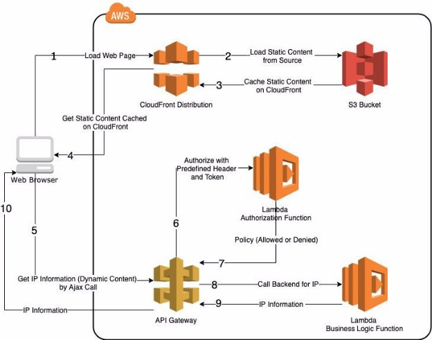
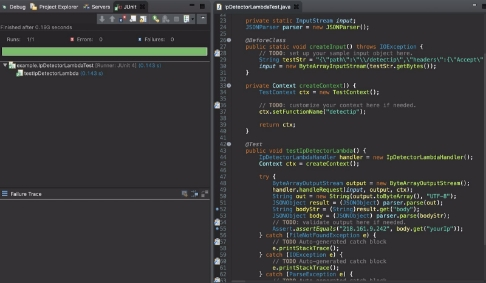
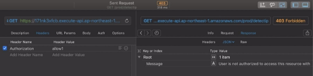
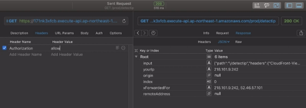
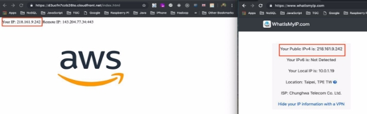
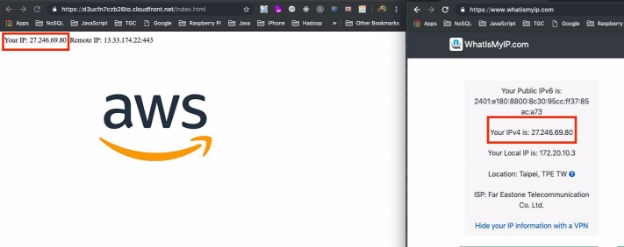
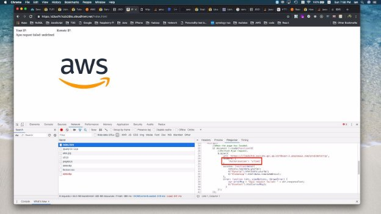

**IP Detector Design Document and Test Report** 

**Application Architecture and Topology** 

- Topology 

Figure 1 

- Application Flow 
1. As illustrated in Figure 1, the browser loads the application from it’s URL. A user would probably think it’s just a website. However, it’s the URL to a CloudFront Distribution. 
1. CloudFront further checks whether the home page itself and the resource files it requires are cached on CloudFront or not. If they are not cached, it loads files from origin, which is a S3 Bucket. 
1. Files loaded from a S3 Bucket are now cached on CloudFront. For further requests to these files, they will be served directly from CloudFront. However, files are not cached on CloudFront forever. It depends on the TTL set on CloudFront or can be invalidated by administrators through AWS console. 
4. Static contents are now downloaded from CloudFront. 
4. An Ajax call initiated to get the IP information is coded in the Javascript of the downloaded home page. The Ajax call is requesting to a http method hosted on API Gateway. 
4. It may not be a good idea for users who get the URL of the API method to get responses due to security reason or better resource control. To achieve that, we put a Lambda authorization function in place to decide whether a request is good to go or not based on the predefined header and token. 
4. If the token is authorized by the Lambda function, it issues an allowed policy. Otherwise, it returns the denied policy to API Gateway and lets it returns a 403 forbidden response. 
4. Once the request gets authorized, it passes the request to the Lambda business logic function. This Lambda functions analyses headers of the request, retrieves the IP Information and adds it to the response of the request. 
4. Lambda returns the IP Information to API Gateway. 
4. API Gateway returns IP Information to the Ajax call initiated by the browser and rendered the IP Information by Javascript. 

**Design Details** 

- CDN 
  - Domain Name: d3ucfn7czb26to.cloudfront.net 
  - We use CloudFront as our CDN solution. The reason why we use CloudFront is that we want to leverage its high performance, high availability, and scalability. Assume that our website is getting popular and lots of users are visiting the website at the same time, the amount of network traffic to the site would increase rapidly. With CloudFront, we don’t need to worry about. It would scale up as it grows. Even if there is something wrong with the static origin and dynamic backend, the cached static version on CloudFront still works well. Besides, it always serves the static content from an edge server that is closest to the client to achieve the best performance. 
  - Another reason to choose CloudFront is that it integrates with S3 for its OAI (Origin Access Identity). By enabling OAI, there is no other ways to access S3 content but through CloudFront URLs. The OAI I use is origin-access-identity/cloudfront/E1OSCFBXXS0TUU .  
- Storage for Static Contents 
  - Bucket Name: ip-detector-yichan-ho 
  - Again, we use S3 for its integration with CloudFront and OAI. Also, S3 has different pricing models based on the access frequency of objects. 
  - In the bucket, I put one folder named js and some files. The js folder contains jQuery library which is required by index.html in the root level. The index.html is the home page of the application. It has a Javascript snippet that triggers Ajax call for IP information. The favicon.ico required by the browser and the aws logo image are also kept in the bucket.  
- Microservice API 
  - Invoke URL: <https://171nk3xfcb.execute-api.ap-northeast-1.amazonaws.com/prod/detectip> 
  - The API is served by API Gateway and it’s a HTTP GET method. 
  - I choose Lambda Function for the integration type and uses the Lambda Function named detectIp. 
  - The API URL can’t be hit directly. It requires a predefined header named Authorization and the value to the header has to be allow to make it through.  
- Authorization 
  - The Authorization is implemented in a Lambda function with Java 8. 
  - Function Name: javaTokenAuthorizer 
  - Function ARN: arn:aws:lambda:ap-northeast-1:177683156638:function:javaTokenAuthorizer 
  - I use the Java Blueprint obtained from GitHub and customize it to meet the my requirement. It takes the token retrieved from TokenAuthorizerContext and checks if the value is allow. If so, it returns the Allow Policy. Otherwise, a Deny Policy is returned. 
  - The Authorizer powered by Lambda has to be configured in API Gateway. The token source of the authorizer must be Authorization to conform with the CORS configuration set in ip-detector-yichan-ho s3 bucket. 
  - After the Authorizer is created, we also need to set the authorization of the target method execution to this authorizer. Here, I name it tokenAuthorizer.  
- Backend Logic 
  - The backend logic is also implemented in a Lambda function with Java 8. 
  - Function Name: detectIp 
  - Function ARN: arn:aws:lambda:ap-northeast-1:177683156638:function:detectIp 
  - Based on the Java template from AWS tutorial, my code is to parse the headers passed in InputStream of the request, look for X-Forwarded-For, get the list stored in it. Ideally, the first IP in the list is the public IP of user. As for remote server IP, there is no relevant header of it. Instead, I use header origin, it is the domain name where the request gets initiated and is also the domain name of the CloudFront distribution. I further translate the domain name into IP by Java’s InetAddress.getAllByName() method. 
  - It is also import to add Access-Control-Allow-Methods and Access-Control-Allow-Headers as the headers to the response to resolve CORS issue. 
- Source Code 
  - Static content of the application 
- Filename: static\_content.zip 
- Also available at [https://s3-ap-northeast-1.amazonaws.com/tam-test-yichan-ho/static_conten t.zip](https://s3-ap-northeast-1.amazonaws.com/tam-test-yichan-ho/static_content.zip)
- Extract the zip file. Go into the static\_content folder and upload all files and folder to a bitbucket 
- Authorizer implemented in Java 
  - Filename: lambda-java-example-token-authorizer.zip 
  - Also available at [https://s3-ap-northeast-1.amazonaws.com/tam-test-yichan-ho/lambda-java- example-token-authorizer.zip](https://s3-ap-northeast-1.amazonaws.com/tam-test-yichan-ho/lambda-java-example-token-authorizer.zip)
  - Extract the zip file and follow the README.txt in it. 
- Backend logic implemented in Java 
  - Filename: lambda-java-example.zip 
  - Also available at [https://s3-ap-northeast-1.amazonaws.com/tam-test-yichan-ho/lambda-java- example.zip](https://s3-ap-northeast-1.amazonaws.com/tam-test-yichan-ho/lambda-java-example.zip)
  - Extract the zip file and follow the README.txt in it. 
- Deployment 
- Basically, I use AWS console to accomplish my deployment. 
- However, I also make a CloudFormation to stimulate my manual deployment. 
- I do not 100% realize the deployment with CloudFormation. What I have achieve is to automatically deploy backend logic lambda, authorizer lambda, and the API gateway for the API method. 
- Template JSON: IpDetectorCloudFormation.json 
- Also available at 

**Test Report** 

- Sample Application URL <https://d3ucfn7czb26to.cloudfront.net/index.html> 
- Java Unit Test 
- Triggered in Eclipse with Java 
- Given the mock input with 218.161.9.242 in X-Forwarded-For, assert the return IP equals 218.161.9.242 
- Test Result: Pass 

- PAW Unit Test 
- Case 1: Enter the Authorization header with illegal value 
- Expected Result: 403 Forbidden and not getting IP Information 
- Test Result: Pass 

- Case 2: Enter the Authorization header with allow 
- Expected Result: 200 Ok and get IP Information 
- Test Result: Pass 

- Function Test 
- Case 1: Compare Application’s IP with 3rd party IP service 
- Expected Result: IPs are the same. 
- Test Result: Pass 

- Case 2: Switch to 4G network and compare Application’s IP with 3rd party IP service 
- Expected Result: IPs are the same. 
- Test Result: Pass 

- Case 3: Modify the Javascript of the Ajax call so that it sends invalid token 
- Expected Result: Not getting IP information 
- Test Result: Pass 

- Known Issues 
- It is not possible to resolve the domain name to the same IP as a browser (Chrome) does. Even though we can do nslookup in a terminal from the same computer, there is no relevant Javascript capability to do so. Instead, I retrieve the origin header in the backend and apply InetAddress.getAllByName() as the alternative solution. However, the IP obtained on the server side probably won’t be the same as what is seen in Chrome since the network topologies for server and browser are different. 
- My CloudFormation template only achieve the deployment of two Lambda functions and one API Gateway. 
- I fail to give API Gateway permission to invoke my Lambda function with CloudFormation template. It needs an additional manual step to make the API accessible through Internet. 
- None of the bonus questions are answered in this delivery.  
